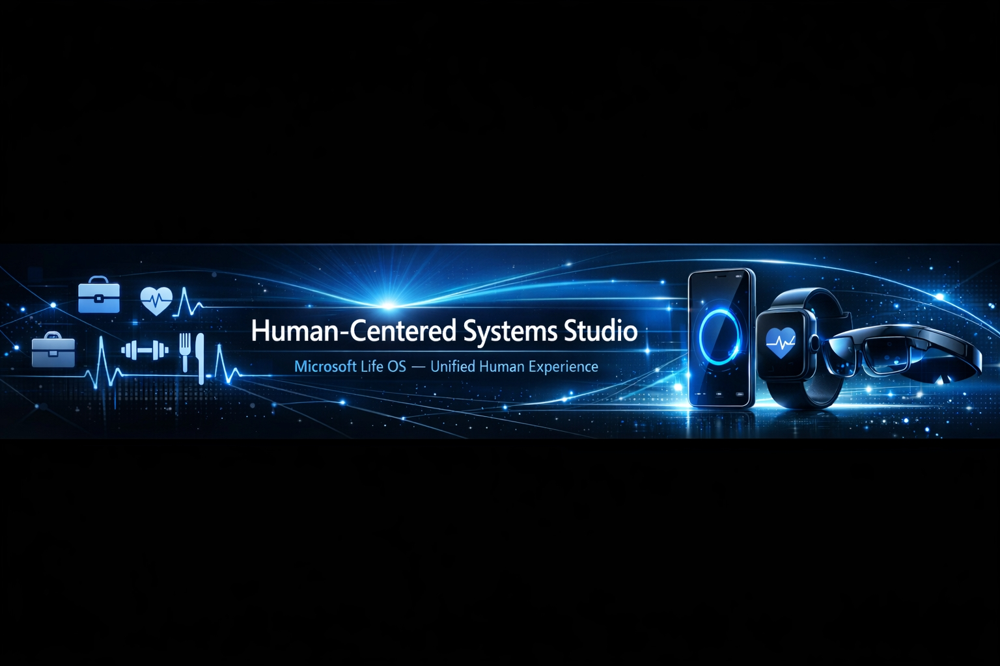

  

# 
🌐 Mohammed Al‑Haddadi — Human‑Centered Tech Designer

A visionary technical designer focused on building human‑centered systems and crafting digital experiences that connect artificial intelligence with real human life.  
I explore future concepts such as Microsoft Life OS — a unified ecosystem that blends daily life, identity, productivity, and wellbeing into one intelligent experience.

---

🎨 About Me
- Human‑Centered Systems Designer  
- Passionate about AI‑integrated experiences  
- Believe that design is not visuals — it’s thinking, structure, and behavior  
- Work on conceptual projects that explore the future of human‑AI interaction  

---

🧠 Design Philosophy

Human‑Centered Systems Thinking
I design from the inside out:  
Human → Behavior → Experience → Technology  
Not the other way around.

My goal is to create systems that feel natural, intuitive, and deeply connected to human needs.

---

🛠️ Skills & Tools
- Human‑Centered Design  
- System Thinking  
- AI‑Driven Interfaces  
- Concept Development  
- Experience Architecture  
- Visual Storytelling  
- Figma / Adobe XD  
- GitHub Projects  
- Technical Documentation  

---

🚀 Featured Project

Microsoft Life OS — Vision Concept
A conceptual operating system that unifies health, productivity, identity, and wellbeing into one AI‑powered human experience.  
Focus areas include:  
- Daily life integration  
- Health & wellbeing  
- Digital identity  
- Productivity intelligence  
- Multi‑device ecosystem  

🔗 Repository:  
https://github.com/HT-محمد/Microsoft-Life-OS-Vision-by-Mohammed

---

📬 Contact
- 📧 Email: badir2040@gmail.com  
- 🔗 LinkedIn: Mohammed Al‑Haddadi  
- 🎥 TikTok: @mohammedalhaddadi  
- 🌍 Saudi Arabia  

---

⭐ Vision
To design systems where technology becomes more human,  
more intuitive,  
and more deeply connected to everyday life.

